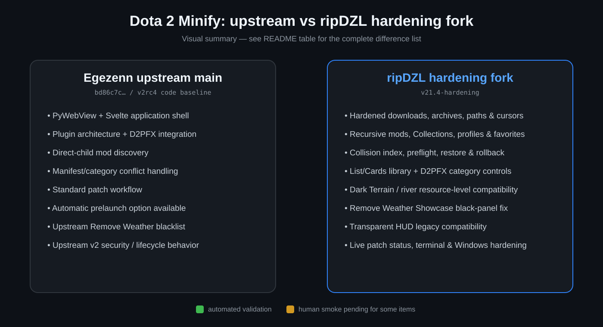

# ripDZL Dota 2 Minify — Hardening Fork

> [!IMPORTANT]
> This is a compatibility, reliability, security, and UX hardening fork of [Egezenn/dota2-minify](https://github.com/Egezenn/dota2-minify).  
> Comparison checked against current upstream `main` at `bd86c7cb619896e7200b7269c1b23245d3037120` on 2026-09-22. Upstream code is still the v2rc4 code baseline; its only commit after `e444454684c2d7f809e7eef20a1b72d4422c50d7` is symbol-documentation only.
>
> Active v2 hardening work currently lives under `V2_STAGING/` until the remaining human Dota smoke gates are complete. Promotion to this fork's `beta` and `main` is intentionally held until that validation is finished.

> [!NOTE]
> **Upstream permission:** [Egezenn](https://github.com/Egezenn) is explicitly welcome to reuse, port, adapt, or merge any ideas, fixes, UI concepts, compatibility rules, tests, or code from this fork into [Egezenn/dota2-minify](https://github.com/Egezenn/dota2-minify). No separate permission from me is needed; normal GPL-3.0/license obligations still apply.

## What is different from upstream?

Status: **✅ automated validation complete** · **🧪 human Windows/Dota smoke still pending** · **⚠ experimental/manual-only**

| Area | ripDZL hardening fork | Current upstream `main` | Status |
| --- | --- | --- | --- |
| v2 architecture | Keeps upstream PyWebView + Svelte + plugin architecture, then ports the fork's hardening and product behavior into it under `V2_STAGING/`. | v2rc4 architecture baseline. | ✅ |
| Security substrate | Central path confinement, bounded downloads, redirect/host validation, archive traversal/symlink defenses, atomic/staged writes, bounded metadata, cursor confinement, and backup validation. | No equivalent centralized hardening layer. | ✅ |
| Mod discovery | Recursive/nested mods, stable logical IDs, Collections, and custom VPK categories. | Direct-child mod discovery and top-level VPK handling. | ✅ |
| Profiles | Save/apply/update/duplicate/import/export profile behavior preserved in the v2 service model. | No equivalent profile subsystem in the current v2 baseline. | ✅ |
| Favorites | Persisted favorites and filtering. | No equivalent favorites subsystem in the current v2 baseline. | ✅ |
| Collision analysis | File/resource-level ownership index, overlap report, and compatibility classification. | Primarily manifest/category conflict handling. | ✅ |
| Patch preflight | Review selected mods, collision counts, estimated resources, compatibility rules, and planned exclusions before patching. | Patch flow does not expose the same resource-level review layer. | 🧪 |
| Restore / rollback | Transactional restore points with validated rollback and selection restoration. | No equivalent restore-point manager. | ✅ |
| Conflict semantics | Category/plugin overlap is advisory; only explicit manifest `conflicts` blocks. | v2 baseline can treat broader category/plugin overlap as conflict input. | ✅ |
| Mod Library layout | Legacy-style **List** is default with optional **Cards**, persistent view choice, filters, collapsible sections, previews, metadata, favorites, details, and state controls. | Card-oriented v2 library baseline. | 🧪 |
| Section controls | Global Select/Clear/Invert plus per-section **All / None** operating on complete section membership. | Does not include the fork's restored legacy section-control behavior. | 🧪 |
| Library organization | Standard Mods, named Collections such as Hero Mods, one collapsible D2PFX parent with internal categories, and VPK sections. | Different baseline grouping/classification behavior. | 🧪 |
| D2PFX category organization | Installed D2PFX mods grouped by stored D2PFX category with category counts and All/None controls. | Flatter baseline organization. | 🧪 |
| D2PFX browser | 5-minute catalogue freshness window, newest-first category results, safe manual refresh fallback, hardened preview/MIME handling, Updated-date parity, max-4 desktop grid, action feedback, stale-search protection, and post-install state refresh. The experimental cross-category Recently Added startup view was removed after human smoke showed it could leave the browser empty. | Upstream v2 D2PFX plugin/browser baseline; catalogue cache can remain stale for 24 hours. | 🧪 |
| D2PFX security | Hardened metadata, preview, archive, install, extraction, and cursor paths with size/count/path limits. | Upstream v2 download/install behavior without the fork's full security substrate. | ✅ |
| Hero defaults | **Defaults except D2PFX** uses actual indexed virtual-resource overlap against enabled D2PFX mods rather than name guesses. | No equivalent overlap-aware Hero default action. | 🧪 |
| Patch visibility | Immediate PREPATCH/PATCH status plus a bounded live terminal on Home. | No equivalent always-visible fork terminal/status behavior. | 🧪 |
| Cache resilience | Derived mod-content index writes are best-effort; Windows sharing/permission failures retry and fall back to in-memory operation instead of aborting PATCH. | Disk-cache replacement failure can be fatal in the baseline path. | 🧪 |
| Dark Terrain | Kept independent from Remove Foliage; deferred resources are yielded only for proven real resource collisions. | Broader terrain-category conflict behavior. | 🧪 |
| Simple Dark Terrain + river mods | River mod owns only proven overlapping river/water resources; Simple Dark Terrain keeps the overlapping `deferred_post_process*` family coherent to prevent Showcase black rectangles. | No equivalent resource-level river ownership rule. | 🧪 |
| Remove Weather Effects | Preserves Dota's `materials/skybox/sky_dota_*.vmat_c` resources while still suppressing rain particles and thunder sounds, avoiding the Showcase/Detail black panel. | Current upstream blacklist still blanks those skybox VMAT resources. | 🧪 |
| Transparent HUD / legacy custom mods | Bundled legacy DearPyGui runtime; manifest-backed obsolete rc7 `ui.details` initial hooks are skipped while other lifecycle scripts remain active; initial-script failure is non-fatal. | v2 baseline does not provide this exact rc7 legacy-HUD compatibility path. | 🧪 |
| Main Menu background | Preserves the extra `#FrontpageContents` collapse rule in addition to the normal dashboard rule. | Only the baseline dashboard-background rule. | ✅ |
| Prelaunch policy | Manual prelaunch behavior; no automatic Steam launch-option injection. | v2 baseline can automatically add prelaunch launch options when enabled. | ✅ |
| Theme / minimum-size UX | Black-Plum carried into the v2 CSS theme system with responsive 960×680 fit rules, compact dialogs, and scroll-safe screens. | Upstream v2 theme/layout baseline. | ✅ |
| Startup flow | Serialized Tutorial/Language Setup modal behavior prevents overlapping startup dialogs; fork identity/version is shown correctly. | Baseline startup behavior. | ✅ |
| Windows build reliability | CI-specific PyInstaller dynamic-library guard fixes the Windows portable-build stall without disabling normal dependency analysis outside CI. | Baseline PyInstaller path. | ✅ |
| RERL tooling | Hardened Source 2 RERL parsing/redirect logic plus reproducible local smoke tooling. Target-name ID rewriting was explicitly rejected after testing. | Newer upstream RERL/remap work exists, but not with the fork's tested constraints. | ✅ |
| Remove Foliage research | Private current-stock alias smoke candidate and local generator; Valve stock binaries are never committed. Dynamic aliasing is intentionally blocked on human Dota validation. | Uses upstream remap behavior. | ⚠ |
| Validation | Latest weather-fix code: **396/396 tests PASS**, Ruff clean, v2 Svelte/plugin validation PASS, root Windows portable PASS, and v2 Windows portable PASS. | Separate upstream validation/release pipeline. | ✅ |

Low-level refactors, generated build files, documentation-only edits, and changes that do not alter behavior are intentionally omitted from this product-level comparison. See [Docs/V2_COMPATIBILITY_MATRIX.md](Docs/V2_COMPATIBILITY_MATRIX.md), [Docs/PROGRESS.md](Docs/PROGRESS.md), and [Docs/TODO.md](Docs/TODO.md) for implementation details and remaining smoke gates.

---

## Original upstream project information and credits

# [Dota2 Minify](https://egezenn.github.io/dota2-minify)

## Thanks

This project wouldn't be available without the work of the community. Thanks to everyone that has contributed to the project over at GitHub and Discord!

## Special thanks to

| Mod                                                                                       | Author                                             | Other                                                                                                        |
| ----------------------------------------------------------------------------------------- | -------------------------------------------------- | ------------------------------------------------------------------------------------------------------------ |
| [`#base`](./Minify/mods/#base)                                                            | [Egezenn](https://github.com/Egezenn)              |                                                                                                              |
| [`#DevTools`](./Minify/mods/#DevTools)                                                    | [Egezenn](https://github.com/Egezenn)              |                                                                                                              |
| [`#English Fix`](./Minify/mods/#English%20Fix)                                            | [Egezenn](https://github.com/Egezenn)              |                                                                                                              |
| [`Auto Accept Match`](./Minify/mods/Auto%20Accept%20Match)                                | [MeGaNeKoS](https://github.com/MeGaNeKoS)          |                                                                                                              |
| [`Custom Backgrounds`](./Minify/mods/Custom%20Backgrounds)                                | [Egezenn](https://github.com/Egezenn)              |                                                                                                              |
| [`Custom Fonts`](./Minify/mods/Custom%20Fonts)                                            | [Egezenn](https://github.com/Egezenn)              |                                                                                                              |
| [`Custom Hero Grids`](./Minify/mods/Custom%20Hero%20Grids)                                | [Egezenn](https://github.com/Egezenn)              | [Project](https://github.com/Egezenn/dota2-precompiled-grids)                                                |
| [`Dark Terrain`](./Minify/mods/Dark%20Terrain)                                            | [robbyz512](https://github.com/robbyz512)          |                                                                                                              |
| [`Minify Base Attacks`](./Minify/mods/Minify%20Base%20Attacks)                            | [robbyz512](https://github.com/robbyz512)          |                                                                                                              |
| [`Minify Spells & Items`](./Minify/mods/Minify%20Spells%20&%20Items)                      | [robbyz512](https://github.com/robbyz512)          |                                                                                                              |
| [`Misc Optimization`](./Minify/mods/Misc%20Optimization)                                  | [robbyz512](https://github.com/robbyz512)          |                                                                                                              |
| [`Mute Ambient Sounds`](./Minify/mods/Mute%20Ambient%20Sounds)                            | [robbyz512](https://github.com/robbyz512)          |                                                                                                              |
| [`Mute Default Announcer`](./Minify/mods/Mute%20Default%20Announcer)                      | [Egezenn](https://github.com/Egezenn)              |                                                                                                              |
| [`Mute Default Kill Spree Sounds`](./Minify/mods/Mute%20Default%20Kill%20Spree%20Sounds/) | [Egezenn](https://github.com/Egezenn)              |                                                                                                              |
| [`Mute Taunt Sounds`](./Minify/mods/Mute%20Taunt%20Sounds)                                | [robbyz512](https://github.com/robbyz512)          |                                                                                                              |
| [`Mute Voice Line Sounds`](./Minify/mods/Mute%20Voice%20Line%20Sounds)                    | [robbyz512](https://github.com/robbyz512)          |                                                                                                              |
| [`OpenDotaGuides Guides`](./Minify/mods/OpenDotaGuides%20Guides)                          | [Egezenn](https://github.com/Egezenn)              | [Project](https://github.com/Egezenn/OpenDotaGuides)                                                         |
| [`Remove Foilage`](./Minify/mods/Remove%20Foilage)                                        | [robbyz512](https://github.com/robbyz512)          |                                                                                                              |
| [`Remove Hero Renders`](./Minify/mods/Remove%20Hero%20Renders)                            | [Egezenn](https://github.com/Egezenn)              |                                                                                                              |
| [`Remove Main Menu Background`](./Minify/mods/Remove%20Main%20Menu%20Background)          | [Egezenn](https://github.com/Egezenn)              |                                                                                                              |
| [`Remove Pings`](./Minify/mods/Remove%20Pings)                                            | [robbyz512](https://github.com/robbyz512)          |                                                                                                              |
| [`Remove River`](./Minify/mods/Remove%20River)                                            | [robbyz512](https://github.com/robbyz512)          |                                                                                                              |
| [`Remove Showcases`](./Minify/mods/Remove%20Showcases)                                    | [Egezenn](https://github.com/Egezenn)              |                                                                                                              |
| [`Remove Sprays`](./Minify/mods/Remove%20Sprays)                                          | [robbyz512](https://github.com/robbyz512)          |                                                                                                              |
| [`Remove Weather Effects`](./Minify/mods/Remove%20Weather%20Effects)                      | [robbyz512](https://github.com/robbyz512)          |                                                                                                              |
| [`Repopulate Unit Query HUD`](./Minify/mods/Repopulate%20Unit%20Query%20HUD)              | [MeGaNeKoS](https://github.com/MeGaNeKoS)          |                                                                                                              |
| [`Reposition & Rescale HUD`](./Minify/mods/Reposition%20&%20Rescale%20HUD)                | [robbyz512](https://github.com/robbyz512)          |                                                                                                              |
| [`Revamp Hero Grid Layout`](./Minify/mods/Revamp%20Hero%20Grid%20Layout)                  | [Egezenn](https://github.com/Egezenn)              |                                                                                                              |
| [`Revert Ping Sounds`](./Minify/mods/Revert%20Ping%20Sounds)                              | [Egezenn](https://github.com/Egezenn)              |                                                                                                              |
| [`Show NetWorth`](./Minify/mods/Show%20NetWorth)                                          | [MeGaNeKoS](https://github.com/MeGaNeKoS)          |                                                                                                              |
| [`Stat Site Buttons`](./Minify/mods/Stat%20Site%20Buttons)                                | [Egezenn](https://github.com/Egezenn)              | Generalized off of `Dotabuff in Profiles` by [yujin sharingan](https://discord.com/users/234341830647480321) |
| [`Transparent HUD`](./Minify/mods/Transparent%20HUD)                                      | [ZerdacK](https://github.com/DotaModdingCommunity) | [Egezenn](https://github.com/Egezenn)                                                                        |
| [`Tree Mod`](./Minify/mods/Tree%20Mod)                                                    | [robbyz512](https://github.com/robbyz512)          |                                                                                                              |
| [`User Styles`](./Minify/mods/User%20Styles)                                              | [Egezenn](https://github.com/Egezenn)              |                                                                                                              |

| Mod Depots                                                          | Author                                | Other                                                                                                                                                                                                                                  |
| ------------------------------------------------------------------- | ------------------------------------- | -------------------------------------------------------------------------------------------------------------------------------------------------------------------------------------------------------------------------------------- |
| [Community Mods](https://github.com/Egezenn/dota2-minify-community) | [Egezenn](https://github.com/Egezenn) | Available thanks to mod authors and maintainers                                                                                                                                                                                        |
| [D2PFX](https://github.com/h6rd/Dota2PornFxWeb)                     | [rotten](https://github.com/h6rd)     | Thanks to [rotten](https://github.com/h6rd) for unifying/maintaining/creating a large collection of VPK mods and [mod authors](https://github.com/h6rd/Dota2PornFxWeb#credits), integrated in by [Egezenn](https://github.com/Egezenn) |

## Dependencies

### Binaries

| Name                                                                          | Usage                        | License                                                                                                                                                 |
| ----------------------------------------------------------------------------- | ---------------------------- | ------------------------------------------------------------------------------------------------------------------------------------------------------- |
| [Inno Setup](https://jrsoftware.org/isinfo.php)                               | Windows Installer generation | [Inno Setup License](https://jrsoftware.org/islicense.php)                                                                                              |
| [Noto Fonts](https://github.com/notofonts)                                    | Fallback general fonts       | [OFL-1.1 license](https://github.com/notofonts/noto-fonts/blob/main/OFL.txt)                                                                            |
| [PyInstaller](https://pyinstaller.org)                                        | Compilation                  | [GPLv2 or later + additional properties](https://github.com/pyinstaller/pyinstaller/blob/develop/COPYING.txt)                                           |
| [Python](https://www.python.org)                                              | Core language                | [PSFL license](https://github.com/python/cpython/blob/main/LICENSE)                                                                                     |
| [ripgrep](https://github.com/BurntSushi/ripgrep)                              | RegExp patterns              | [Unlicense](https://github.com/BurntSushi/ripgrep/blob/master/UNLICENSE) & [MIT license](https://github.com/BurntSushi/ripgrep/blob/master/LICENSE-MIT) |
| [Source 2 Viewer](https://github.com/ValveResourceFormat/ValveResourceFormat) | Asset decompilation          | [MIT license](https://github.com/ValveResourceFormat/ValveResourceFormat/blob/master/LICENSE)                                                           |

### Python packages

| Name                                                                   | Usage                                     | License                                                                           |
| ---------------------------------------------------------------------- | ----------------------------------------- | --------------------------------------------------------------------------------- |
| [dearpygui](https://github.com/hoffstadt/DearPyGui)                    | GUI                                       | [MIT license](https://github.com/hoffstadt/DearPyGui/blob/master/LICENSE)         |
| [defusedxml](https://github.com/tiran/defusedxml)                      | Secure XML parsing                        | [PSFL license](https://github.com/tiran/defusedxml/blob/main/LICENSE)             |
| [json-with-comments](https://github.com/n-takumasa/json-with-comments) | JSON parsing with comments                | [MIT license](https://github.com/n-takumasa/json-with-comments/blob/main/LICENSE) |
| [playsound3](https://github.com/szmikler/playsound3)                   | Playing sounds                            | [MIT license](https://github.com/szmikler/playsound3/blob/main/LICENSE)           |
| [psutil](https://github.com/giampaolo/psutil)                          | Checking processes existences             | [BSD-3-Clause license](https://github.com/giampaolo/psutil/blob/master/LICENSE)   |
| [requests](https://github.com/psf/requests)                            | Downloading/querying project dependencies | [Apache-2.0 license](https://github.com/psf/requests/blob/main/LICENSE)           |
| [screeninfo](https://github.com/rr-/screeninfo)                        | Position calculation                      | [MIT license](https://github.com/rr-/screeninfo/blob/master/LICENSE.md)           |
| [typer](https://github.com/fastapi/typer)                              | CLI framework                             | [MIT license](https://github.com/fastapi/typer/blob/master/LICENSE)               |
| [vdf](https://github.com/ValvePython/vdf)                              | Serializing VDFs                          | [MIT license](https://github.com/ValvePython/vdf/blob/master/LICENSE)             |
| [vpk](https://github.com/ValvePython/vpk)                              | VPK interaction                           | [MIT license](https://github.com/ValvePython/vpk/blob/master/LICENSE)             |

### Development dependencies

| Name                                           | Usage                | License                                                               |
| ---------------------------------------------- | -------------------- | --------------------------------------------------------------------- |
| [pytest](https://github.com/pytest-dev/pytest) | Testing framework    | [MIT license](https://github.com/pytest-dev/pytest/blob/main/LICENSE) |
| [ruff](https://github.com/astral-sh/ruff)      | Linter and formatter | [MIT license](https://github.com/astral-sh/ruff/blob/main/LICENSE)    |

## Sponsors

<table align="center">
  <tbody>
    <tr>
      <td align="center">
        
      </td>
      <td>
        Thanks to <a href="https://weblate.org">Weblate</a> for powering our translations and providing Libre Hosting!
      </td>
    </tr>
    <tr>
      <td align="center">
        
      </td>
      <td>
        Free code signing on Windows provided by <a href="https://signpath.io/?utm_source=foundation&utm_medium=github&utm_campaign=dota2-minify">SignPath.io</a>, certificate by <a href="https://signpath.org/?utm_source=foundation&utm_medium=github&utm_campaign=dota2-minify">SignPath Foundation</a>.
      </td>
    </tr>
  </tbody>
</table>

## License

Contents of this repository are licensed under [GPL-3.0](LICENSE).

> [!NOTE]
> The project logo and some assets in `Minify/mods/*/files` originate from Dota 2 (Valve Corporation).
